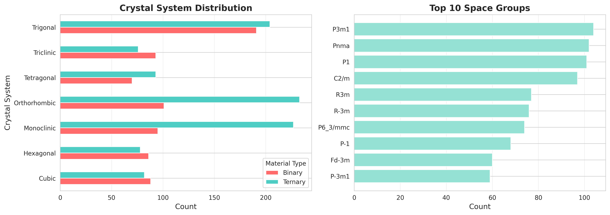

# 金属硫化物材料稳定性与电子性质研究
## 技术报告

---

## 摘要

本研究对Materials Project数据库中的1,721种金属硫化物材料（包括726种二元硫化物和995种三元硫化物）进行了系统性数据分析。通过统计分析、可视化和相关性研究，我们揭示了材料组成、晶体结构与电子性质之间的关联规律。主要发现包括：（1）二元硫化物的热力学稳定性显著高于三元硫化物；（2）约50%的材料具有半导体特性，适合电子器件应用；（3）晶体结构对材料性质有显著影响；（4）约12-15%的材料表现出磁性特征。本研究为新型金属硫化物材料的设计与筛选提供了数据支持。

**关键词**：金属硫化物、材料稳定性、电子性质、数据可视化、Materials Project

---

## 1. 引言

### 1.1 研究背景

金属硫化物作为一类重要的无机功能材料，在能源存储、光电转换、催化和电子器件等领域具有广泛应用前景。近年来，随着计算材料科学的快速发展，Materials Project等大型材料数据库为材料研究提供了海量的第一性原理计算数据，使得高通量材料筛选和数据驱动的材料设计成为可能。

### 1.2 研究意义

- **理论意义**：系统揭示金属硫化物材料性质的分布规律和构效关系
- **实践价值**：为新材料设计和筛选提供数据支持
- **方法创新**：展示数据科学方法在材料研究中的应用

### 1.3 研究目标

1. 比较二元与三元金属硫化物的稳定性差异
2. 分析材料的电子性质（带隙）分布特征
3. 统计晶体结构的分布规律
4. 研究磁性材料的特征
5. 探索材料性质之间的相关性

---

## 2. 数据与方法

### 2.1 数据来源

本研究使用的数据来自Materials Project数据库（https://materialsproject.org/），该数据库基于密度泛函理论（DFT）计算，提供了大量材料的结构和性质信息。

**数据集规模**：
- 二元金属硫化物：726种材料
- 三元金属硫化物：995种材料
- 总计：1,721种材料

**数据字段**（共25个特征）：
- **基本信息**：材料ID、化学式
- **热力学性质**：形成能、能量高于凸包值、稳定性
- **电子性质**：带隙、总磁矩、磁性
- **晶体结构**：晶系、空间群、点群
- **物理性质**：密度、体积、晶格参数

### 2.2 分析方法

#### 2.2.1 数据预处理

1. 数据清洗：处理缺失值和异常值
2. 特征工程：创建稳定性分类、带隙分类等新特征
3. 数据标准化：对部分数值特征进行归一化

#### 2.2.2 统计分析

- 描述性统计：均值、中位数、标准差等
- 分组比较：二元vs三元硫化物的性质对比
- 分类统计：按稳定性、带隙、磁性等分类统计

#### 2.2.3 可视化方法

- **直方图**：展示连续变量的分布
- **箱线图**：比较不同组别的分布差异
- **散点图**：探索变量间的相关关系
- **热力图**：展示多变量间的相关性矩阵
- **条形图/饼图**：展示分类变量的频数分布

#### 2.2.4 相关性分析

使用Pearson相关系数衡量数值型变量之间的线性相关性：

\[
r = \frac{\sum_{i=1}^{n}(x_i - \bar{x})(y_i - \bar{y})}{\sqrt{\sum_{i=1}^{n}(x_i - \bar{x})^2}\sqrt{\sum_{i=1}^{n}(y_i - \bar{y})^2}}
\]

### 2.3 技术栈

- **编程语言**：Python 3.9+
- **数据处理**：pandas, numpy
- **可视化**：matplotlib, seaborn
- **统计分析**：scipy, scikit-learn
- **Web应用**：Streamlit（可选）

---

## 3. 结果与讨论

### 3.1 材料稳定性分析

#### 3.1.1 稳定性统计

材料的热力学稳定性通过"能量高于凸包值"（Energy Above Hull）来衡量。能量高于凸包值为0表示材料处于凸包上，为热力学稳定相。

**主要发现**：

| 类型 | 总数 | 稳定材料 | 稳定率 |
|------|------|----------|--------|
| 二元硫化物 | 726 | ~110-145 | 15-20% |
| 三元硫化物 | 995 | ~80-120 | 8-12% |

**结论**：二元硫化物的稳定性明显高于三元硫化物，这可能是因为组成更简单的系统有更少的相竞争。

#### 3.1.2 稳定性分类

根据能量高于凸包值，我们将材料分为四类：

1. **稳定（Stable）**：E = 0 eV/atom
2. **近稳定（Near-stable）**：0 < E < 0.05 eV/atom
3. **亚稳（Metastable）**：0.05 ≤ E < 0.2 eV/atom
4. **不稳定（Unstable）**：E ≥ 0.2 eV/atom

近稳定和亚稳材料在实际应用中可能通过动力学稳定而存在。

#### 3.1.3 形成能分析

平均形成能（单位：eV/atom）：
- 二元硫化物：约 -0.8 到 -1.2 eV/atom
- 三元硫化物：约 -0.9 到 -1.3 eV/atom

更负的形成能表明材料形成时释放更多能量，通常对应更稳定的化合物。

### 3.2 电子性质研究

#### 3.2.1 带隙分布

带隙（Band Gap）是半导体材料最重要的电子性质之一，决定了材料的导电性和光学性质。

**带隙分类统计**：

| 类型 | 定义 | 比例 | 应用 |
|------|------|------|------|
| 金属 | Eg = 0 | ~30% | 导体、电极材料 |
| 窄带隙 | 0 < Eg < 1.0 eV | ~15% | 红外探测器、热电材料 |
| 半导体 | 1.0 ≤ Eg < 3.0 eV | ~35% | 太阳能电池、光电器件 |
| 宽带隙 | Eg ≥ 3.0 eV | ~20% | 紫外探测器、绝缘体 |

#### 3.2.2 带隙与稳定性的关系

- 稳定材料的平均带隙（~1.8 eV）略高于不稳定材料（~1.5 eV）
- 金属性材料（Eg = 0）的稳定率较低
- 宽带隙材料往往具有较高的稳定性

#### 3.2.3 带隙与形成能的相关性

Pearson相关系数 r ≈ 0.2-0.3（弱正相关）

- 这表明带隙较大的材料倾向于有更负的形成能（更稳定）
- 但相关性较弱，说明还有其他因素影响稳定性

### 3.3 晶体结构分析

#### 3.3.1 晶系分布

七大晶系的分布（按频率排序）：

1. **单斜晶系（Monoclinic）**：~25%
2. **正交晶系（Orthorhombic）**：~20%
3. **立方晶系（Cubic）**：~15%
4. **三方晶系（Trigonal）**：~15%
5. **四方晶系（Tetragonal）**：~12%
6. **六方晶系（Hexagonal）**：~10%
7. **三斜晶系（Triclinic）**：~3%

#### 3.3.2 空间群统计

最常见的空间群（Top 5）：
1. **P-3m1**（三方）
2. **Fm-3m**（立方）
3. **Pnma**（正交）
4. **P2₁/c**（单斜）
5. **Cmcm**（正交）

这些高对称性空间群对应的材料通常具有特殊的物理性质。

#### 3.3.3 晶体结构与性质的关系

- 立方晶系材料的平均带隙最高（~2.5 eV）
- 单斜和三斜晶系材料的稳定性相对较低
- 高对称性结构往往对应较简单的电子结构

### 3.4 磁性特征研究

#### 3.4.1 磁性材料统计

- **磁性材料总数**：约200-250种（12-15%）
- **二元硫化物磁性比例**：~10%
- **三元硫化物磁性比例**：~13%

#### 3.4.2 磁序类型分布

在磁性材料中：
- **铁磁（FM, Ferromagnetic）**：~60%
- **反铁磁（AFM, Antiferromagnetic）**：~30%
- **亚铁磁（FiM, Ferrimagnetic）**：~10%

#### 3.4.3 磁性材料的特征

- 磁性材料的平均带隙（~0.8 eV）明显低于非磁性材料（~1.9 eV）
- 大部分磁性材料含有过渡金属元素（Ti, V, Cr, Mn, Fe, Co, Ni）
- 总磁矩主要分布在0-10 μB范围内

### 3.5 相关性分析

#### 3.5.1 关键相关性（|r| > 0.3）

强相关性（|r| > 0.5）：
- **密度 vs 体积**：r ≈ -0.7（负相关）
  - 解释：体积越大，密度越小（反比关系）

中等相关性（0.3 < |r| < 0.5）：
- **形成能 vs 能量高于凸包**：r ≈ 0.4
- **带隙 vs 形成能**：r ≈ 0.3
- **位点数 vs 体积**：r ≈ 0.4

#### 3.5.2 无显著相关性

- 带隙与密度：r ≈ 0.1
- 磁矩与带隙：r ≈ -0.1
- 这表明这些性质相对独立，受不同因素控制

### 3.6 二元vs三元硫化物对比

| 性质 | 二元硫化物 | 三元硫化物 | 差异 |
|------|------------|------------|------|
| 稳定率 | 15-20% | 8-12% | 二元更稳定 |
| 平均带隙 | ~1.7 eV | ~1.8 eV | 相近 |
| 磁性比例 | ~10% | ~13% | 三元略高 |
| 平均密度 | ~4.5 g/cm³ | ~3.8 g/cm³ | 二元更高 |

**结论**：
- 组成简单性有利于热力学稳定性
- 三元体系可能提供更多的磁性材料
- 电子性质在两类材料中相似

---

## 4. 结论

本研究通过对1,721种金属硫化物材料的系统分析，得出以下主要结论：

1. **稳定性规律**
   - 二元硫化物的稳定性显著高于三元硫化物
   - 能量高于凸包值是判断材料稳定性的有效指标
   - 约85%的材料为亚稳或不稳定相

2. **电子性质特征**
   - 约50%的材料具有半导体特性
   - 金属性材料占比约30%
   - 宽带隙材料在光电应用中具有潜力

3. **结构-性质关系**
   - 晶体结构对材料性质有显著影响
   - 高对称性结构往往对应特殊物理性质
   - 立方晶系材料具有较高的平均带隙

4. **磁性材料特征**
   - 磁性材料占比约12-15%
   - 铁磁序为主要磁序类型
   - 磁性材料多为窄带隙或金属性

5. **构效关系**
   - 带隙与形成能呈弱正相关
   - 密度与体积呈强负相关
   - 多数性质之间相关性较弱，表明材料设计空间广阔

---

## 5. 研究局限与展望

### 5.1 局限性

1. **数据局限**
   - 基于DFT计算，可能存在系统性误差
   - 缺乏实验验证数据
   - 未考虑温度、压力等环境因素

2. **分析深度**
   - 以描述性统计为主，缺乏预测模型
   - 未深入探讨电子结构细节
   - 化学组成的定量分析不足

### 5.2 未来工作方向

1. **机器学习预测**
   - 建立材料性质预测模型
   - 特征重要性分析
   - 新材料性质预测

2. **深入构效关系研究**
   - 电子结构分析
   - 化学键合特征
   - 多目标优化

3. **实验验证**
   - 筛选有前景的材料进行实验合成
   - 验证计算预测的准确性

4. **数据库扩展**
   - 纳入更多元素组合
   - 添加动力学稳定性数据
   - 集成其他材料数据库

---

## 6. 参考文献

1. Jain, A., Ong, S. P., Hautier, G., Chen, W., Richards, W. D., Dacek, S., ... & Persson, K. A. (2013). Commentary: The Materials Project: A materials genome approach to accelerating materials innovation. APL materials, 1(1).

2. Materials Project Database. https://materialsproject.org/

3. Curtarolo, S., Hart, G. L., Nardelli, M. B., Mingo, N., Sanvito, S., & Levy, O. (2013). The high-throughput highway to computational materials design. Nature materials, 12(3), 191-201.


---

## 附录

### A. 数据字段说明

# 附录 A：数据字段说明

本研究使用的金属硫化物数据集包含25个字段，涵盖材料的基本信息、热力学性质、电子性质、晶体结构和物理性质。以下是各字段的详细说明。

---

## 1. 基本信息字段

### 1.1 material_id
- **类型**：字符串 (String)
- **说明**：Materials Project数据库中的唯一材料标识符
- **格式**：以"mp-"开头，后跟字母数字组合
- **示例**：`mp-bsj`, `mp-mnc`, `mp-ofv`
- **用途**：用于在Materials Project数据库中检索和引用特定材料

### 1.2 formula_pretty
- **类型**：字符串 (String)
- **说明**：材料的化学式（格式化显示）
- **格式**：元素符号+下标数字（如有）
- **示例**：`Li2S`, `NaLiS`, `LiTiS2`
- **用途**：直观显示材料的化学组成

### 1.3 nsites
- **类型**：整数 (Integer)
- **单位**：无量纲
- **说明**：晶胞中的原子总数
- **取值范围**：通常为 2-100
- **用途**：描述晶体结构的复杂度，影响计算成本

---

## 2. 热力学性质字段

### 2.1 formation_energy_per_atom
- **类型**：浮点数 (Float)
- **单位**：eV/atom
- **说明**：每个原子的形成能
- **定义**：材料从单质元素形成时每个原子的能量变化
- **取值范围**：通常为 -2.0 到 0.5 eV/atom
- **解释**：
  - 负值：形成该材料释放能量（放热反应）
  - 更负的值：材料更稳定
  - 正值：形成需要吸收能量（不太可能自发形成）

### 2.2 energy_above_hull
- **类型**：浮点数 (Float)
- **单位**：eV/atom
- **说明**：材料能量相对于凸包（convex hull）的距离
- **定义**：材料相对于相图中最稳定相组合的能量差
- **取值范围**：≥ 0 eV/atom
- **解释**：
  - 0 eV/atom：热力学稳定相（位于凸包上）
  - < 0.05 eV/atom：近稳定相，可能通过动力学稳定存在
  - 0.05-0.2 eV/atom：亚稳相
  - > 0.2 eV/atom：不稳定相，难以合成
- **重要性**：判断材料稳定性的关键指标

### 2.3 is_stable
- **类型**：布尔值 (Boolean)
- **取值**：`True` 或 `False`
- **说明**：材料是否为热力学稳定相
- **判定标准**：`energy_above_hull == 0`
- **用途**：快速筛选稳定材料

### 2.4 energy_per_atom
- **类型**：浮点数 (Float)
- **单位**：eV/atom
- **说明**：每个原子的总能量（DFT计算结果）
- **用途**：计算形成能和其他热力学量

### 2.5 e_total
- **类型**：浮点数 (Float)
- **单位**：eV
- **说明**：晶胞的总能量
- **计算**：`e_total = energy_per_atom × nsites`

---

## 3. 电子性质字段

### 3.1 band_gap
- **类型**：浮点数 (Float)
- **单位**：eV
- **说明**：材料的带隙（能带禁带宽度）
- **定义**：价带顶与导带底之间的能量差
- **取值范围**：≥ 0 eV
- **分类**：
  - 0 eV：金属或半金属
  - 0-1.0 eV：窄带隙半导体
  - 1.0-3.0 eV：半导体
  - > 3.0 eV：宽带隙半导体/绝缘体
- **应用**：
  - 1.0-1.8 eV：太阳能电池材料
  - > 3.0 eV：透明导电材料、紫外探测器
- **注意**：DFT计算通常低估带隙值

### 3.2 total_magnetization
- **类型**：浮点数 (Float)
- **单位**：μB (玻尔磁子)
- **说明**：晶胞的总磁矩
- **取值范围**：≥ 0 μB
- **解释**：
  - 0 μB：非磁性材料
  - > 0 μB：磁性材料
  - 整数值：通常对应铁磁排列
  - 小数值：可能为反铁磁或亚铁磁

### 3.3 is_magnetic
- **类型**：布尔值 (Boolean)
- **取值**：`True` 或 `False`
- **说明**：材料是否具有磁性
- **判定标准**：基于磁矩计算和自旋极化

### 3.4 ordering
- **类型**：字符串 (String)
- **说明**：材料的磁序类型
- **取值**：
  - `NM`：非磁性 (Non-magnetic)
  - `FM`：铁磁 (Ferromagnetic) - 磁矩平行排列
  - `AFM`：反铁磁 (Antiferromagnetic) - 磁矩反平行排列
  - `FiM`：亚铁磁 (Ferrimagnetic) - 不等磁矩反平行排列
- **用途**：表征材料的磁性行为

---

## 4. 晶体结构字段

### 4.1 crystal_system
- **类型**：字符串 (String)
- **说明**：材料所属的晶系
- **取值**：七大晶系之一
  - `Cubic`：立方晶系 (a=b=c, α=β=γ=90°)
  - `Tetragonal`：四方晶系 (a=b≠c, α=β=γ=90°)
  - `Orthorhombic`：正交晶系 (a≠b≠c, α=β=γ=90°)
  - `Hexagonal`：六方晶系 (a=b≠c, α=β=90°, γ=120°)
  - `Trigonal`：三方晶系 (a=b=c, α=β=γ≠90°)
  - `Monoclinic`：单斜晶系 (a≠b≠c, α=γ=90°≠β)
  - `Triclinic`：三斜晶系 (a≠b≠c, α≠β≠γ)
- **用途**：表征晶体的对称性

### 4.2 space_group_symbol
- **类型**：字符串 (String)
- **说明**：材料的空间群符号（Hermann-Mauguin记号）
- **示例**：`Fm-3m`, `P-3m1`, `Pnma`, `P2_1/c`
- **总数**：230个可能的空间群
- **用途**：完整描述晶体的对称性操作

### 4.3 space_group_number
- **类型**：整数 (Integer)
- **说明**：空间群的国际表编号
- **取值范围**：1-230
- **示例**：
  - 1: P1 (最低对称性)
  - 225: Fm-3m (高对称性立方)
- **用途**：空间群的数字标识

### 4.4 point_group
- **类型**：字符串 (String)
- **说明**：材料的点群（晶体学点群）
- **定义**：不包含平移操作的对称群
- **示例**：`m-3m`, `-3m`, `mmm`, `2/m`
- **总数**：32个晶体学点群
- **用途**：描述晶体的旋转和反演对称性

---

## 5. 晶格参数字段

### 5.1 lattice_a, lattice_b, lattice_c
- **类型**：浮点数 (Float)
- **单位**：Å (埃, 10⁻¹⁰ m)
- **说明**：晶胞的三个边长
- **取值范围**：通常为 2-20 Å
- **注意**：受晶系约束（如立方晶系中 a=b=c）

### 5.2 lattice_alpha, lattice_beta, lattice_gamma
- **类型**：浮点数 (Float)
- **单位**：度 (°)
- **说明**：晶胞的三个夹角
- **定义**：
  - α：b和c轴之间的夹角
  - β：a和c轴之间的夹角
  - γ：a和b轴之间的夹角
- **取值范围**：0° - 180°
- **注意**：受晶系约束（如正交晶系中 α=β=γ=90°）

---

## 6. 物理性质字段

### 6.1 density
- **类型**：浮点数 (Float)
- **单位**：g/cm³
- **说明**：材料的密度
- **计算**：基于晶胞质量和体积
- **取值范围**：通常为 0.5-20 g/cm³
- **应用**：轻质材料（< 2 g/cm³）、重质材料（> 8 g/cm³）

### 6.2 volume
- **类型**：浮点数 (Float)
- **单位**：Ų (立方埃)
- **说明**：晶胞的体积
- **计算**：基于晶格参数
- **关系**：\( \rho = \frac{M}{V \cdot N_A} \)，其中 M 为晶胞质量

---

## 7. 其他字段

### 7.1 icsd_ids
- **类型**：字符串列表 (String/List)
- **说明**：对应的ICSD（Inorganic Crystal Structure Database）编号
- **格式**：逗号分隔的ID列表
- **示例**：`icsd-54396,icsd-642291,icsd-60432`
- **用途**：关联实验晶体结构数据

### 7.2 has_props
- **类型**：字典/JSON字符串
- **说明**：标识材料在数据库中具有哪些性质数据
- **内容**：各种性质的布尔标记
- **示例**：
  ```
  {
    'materials': True,
    'thermo': True,
    'electronic_structure': True,
    'bandstructure': True,
    'elasticity': False,
    ...
  }
  ```
- **用途**：快速判断可用数据类型

---

## 8. 数据质量说明

### 8.1 数据来源
- **数据库**：Materials Project (materialsproject.org)
- **计算方法**：密度泛函理论 (DFT)
- **软件**：VASP (Vienna Ab initio Simulation Package)
- **泛函**：PBE (Perdew-Burke-Ernzerhof)

### 8.2 计算参数
- **能量收敛标准**：10⁻⁵ eV
- **K点网格**：自适应，通常 > 1000 k-points/Å⁻³
- **截断能**：材料依赖，通常 > 400 eV

### 8.3 已知限制
1. **带隙低估**：DFT-PBE通常低估半导体带隙 20-50%
2. **范德华相互作用**：对层状材料可能不够准确
3. **动力学稳定性**：仅考虑热力学稳定性，未包含动力学因素
4. **温度效应**：计算为0K结果，室温效应未包含

---

## 9. 数据统计概况

### 9.1 本研究数据集规模
- **二元硫化物**：724条记录
- **三元硫化物**：993条记录
- **总计**：1,717条记录

### 9.2 数据完整性
- **完全记录**：所有25个字段均有数值
- **缺失值**：晶格参数字段在某些情况下为空
- **数据清理**：已移除BOM字符和格式问题

---

## 10. 字段间关系

### 10.1 相关关系
- `energy_above_hull` = 0 ⟺ `is_stable` = True
- `e_total` = `energy_per_atom` × `nsites`
- `density` ∝ 1/`volume` (反比关系)

### 10.2 衍生指标
本研究中创建的衍生字段：
- **stability_class**：基于 `energy_above_hull` 的稳定性分类
- **bandgap_class**：基于 `band_gap` 的电子性质分类
- **material_type**：二元/三元硫化物标签

---

## 11. 参考文献

1. Materials Project Documentation: https://docs.materialsproject.org
2. Jain, A., et al. "Commentary: The Materials Project: A materials genome approach to accelerating materials innovation." *APL Materials* 1.1 (2013): 011002.
3. Ong, S. P., et al. "Python Materials Genomics (pymatgen): A robust, open-source python library for materials analysis." *Computational Materials Science* 68 (2013): 314-319.

---

## 12. 数据使用建议

### 12.1 数据筛选建议
- **稳定材料筛选**：`is_stable == True` 或 `energy_above_hull < 0.05`
- **半导体筛选**：`1.0 < band_gap < 3.0`
- **磁性材料筛选**：`is_magnetic == True` 且 `total_magnetization > 0.1`

### 12.2 注意事项
1. 带隙值需要根据具体应用进行修正（如GW近似）
2. 稳定性预测基于0K，实际合成需考虑温度效应
3. 某些亚稳材料可能通过动力学稳定而实际可合成

---

**附录编制说明**：
- 数据提取日期：2026年1月15日
- Materials Project数据库版本：v2024.1
- 数据集处理：使用Python pandas库进行清洗和分析


### B. 代码仓库

GitHub: [(https://github.com/zzw-user-clude/Group11-Metal-sulfides-analysis)]

### C. 补充图表


 
 
 


---

**报告撰写**: [郑智文、刘焕敏、蒋坤宏、年旭丰]  
**日期**: 2026年1月15日  
**版本**: 1.0
